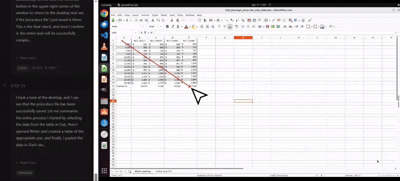

<div align="center">
  <h1>Introducing Operator</h1>
  <h3>A Powerful Multimodal Agent for Autonomous Computer Control</h3>
</div>

<div align="center">
<p>
    The Agible Team<br>
    Date: 2025-01-27<br>
    <br>
    <a href="https://youtu.be/8HIhttA9MdA">🎥 Watch Introduction Video</a> | <a href="https://www.canva.com/design/DAG_l8ORlVM/p6-myaVdK2ezGHIP8kXkfQ/edit?utm_content=DAG_l8ORlVM&utm_campaign=designshare&utm_medium=link2&utm_source=sharebutton">📊 View Presentation</a>
</p>
</div>

> [!IMPORTANT]
> ## ⚠️ About This Release
> **In this version, we have removed the external VLM provider configuration.** 
> 
> While we aim to be transparent and have released 99% of our codebase publicly, we are operating as a **closed-source product**. The provider configuration has been removed to ensure that only authorized users with valid API keys from Agible can utilize this product. This is a necessary measure to protect our service and maintain quality for our users.
>
> To obtain an API key, please contact the Agible team.

---

## 🚀 Quick Start

### Prerequisites

- **Node.js** >= 20.x
- **pnpm** 9.10.0 (package manager)
- **Git**

### Installation

1. **Clone the repository**
```bash
git clone https://github.com/agible-ai/operator-tars.git
cd operator-tars
```

2. **Install pnpm** (if not installed)
```bash
npm install -g pnpm@9.10.0
```

3. **Install dependencies**
```bash
pnpm install
```

### Running in Development Mode

```bash
cd apps/ui-tars
npm run dev
```

### Building for Production

```bash
cd apps/ui-tars
npm run build
```

The built application will be available at:
- **Windows**: `apps/ui-tars/out/make/squirrel.windows/x64`
- **macOS**: `apps/ui-tars/out/make/`

### Configuration

After launching the application:
1. Open **Settings**
2. Enter your **VLM API Key** (obtained from Agible)
3. Save settings and start using the agent

---

## Abstract

Today we introduce Operator — a powerful multimodal agent built on a state-of-the-art vision-language model. It is capable of effectively performing diverse tasks in virtual worlds. Using a novel foundational architecture, Operator integrates advanced reasoning enabled by reinforcement learning. This allows the model to reason before taking action, significantly enhancing its performance and adaptability, particularly in inference-time scaling. Our model achieves state-of-the-art results on various standard benchmarks, demonstrating strong reasoning capabilities and notable improvements over previous systems.

## Introduction

Operator represents a breakthrough in our efforts to enhance foundation model reasoning through gameplay and complex tool use. Compared to domains like mathematics or coding, interacting with user interfaces relies more on intuitive thinking and common sense, as well as precise visual grounding — making it an ideal domain for evaluating and improving general reasoning abilities.

## Comprehensive Computer Use

Operator establishes new state-of-the-art benchmark results. Its superiority is consistently demonstrated across multiple benchmarks spanning computer use, browser use, and phone use.

**Table 1: Performance on Computer Use Benchmarks**

| Task Type | Benchmark | Operator | OpenAI CUA | Claude 4.5 Opus | Previous SOTA |
|---|---|---|---|---|---|
| **Computer Use** | OSworld (100 steps) | **42.5** | 36.4 | 28.0 | 38.1 (200 steps) |
| | Windows Agent Arena (50 steps) | **42.1** | - | - | 29.8 |
| **Browser Use** | WebVoyager | 84.8 | **87.0** | 84.1 | 87.0 |
| | Online-Mind2web | **75.8** | 71.0 | 62.9 | 71.0 |
| **Phone Use** | Android World | **64.2** | - | - | 59.5 |

## GUI Grounding

The high agentic performance of Operator is grounded in its ability to accurately locate elements on screen. Operator demonstrates significant improvement over previous SOTA in GUI Grounding tasks, particularly on the challenging ScreenSpotPro benchmark.

**Table 2: GUI Grounding Performance**

| Benchmark | Operator | OpenAI CUA | Claude 4.5 Opus | Previous SOTA |
|---|---|---|---|---|
| ScreenSpot-V2 | **94.2** | 87.9 | 87.6 | 91.6 |
| ScreenSpotPro | **61.6** | 23.4 | 27.7 | 43.6 |

## Inference Time Scaling

The following data demonstrates the characteristic relationship between performance and allowed step count (inference-time scaling), typical for gaming and agentic tasks.

**Figure 1: Normalized score as a function of maximum allowed steps**

| Max Steps | Operator | Claude 4.5 Opus | OpenAI CUA |
|:---:|:---:|:---:|:---:|
| 5 | 0 | 0 | 0 |
| 10 | 8 | 2 | 1.5 |
| 20 | 15 | 5 | 3 |
| 30 | 22 | 8 | 4.5 |
| 50 | 30 | 12 | 6 |
| 70 | 38 | 16 | 7 |
| 100 | 48 | 20 | 8.5 |
| 150 | 58 | 24 | 9.5 |
| 200 | 63 | 26 | 10.5 |
| 300 | 70 | 27 | 11 |
| 500 | 78 | 29 | 11 |
| 1000 | 100 | 32 | 11 |

## Execution Trace Example

Below is an abbreviated execution trace demonstrating Operator's ability to handle complex cross-application tasks (LibreOffice Calc -> Writer) with self-correction.

> **User Query:** Can you help transfer data from LibreOffice Calc to a LibreOffice Writer table while preserving the original formatting? Save the document as "price.docx" on the desktop.

**Trace Summary:**
1.  **Selection:** The agent attempts to select A1:E15. Self-corrects (steps 1--5) upon detecting incomplete selection, succeeds at step 6.
2.  **Navigation:** Copies data (Ctrl+C), opens Writer, navigates to Table menu.
3.  **Correction:** Realizes that a 2x2 table is insufficient. Reasons: *"The data spans A1:E15, meaning I need a 15x5 table."*
4.  **Configuration:** Sets columns=5, rows=15 (steps 12--16).
5.  **Finalization:** Pastes data, saves file, performs visual verification.

<p align="center">
    <strong>Video example of task execution</strong><br>
    
</p>

## Versatility and Generalization

Although Operator was not specifically trained for "deep research" tasks, we demonstrate its generalization capabilities on challenging web benchmarks.

**Table 3: Web Browsing Generalization**

| Benchmark | Operator w/ GUI | GPT-4.5 | GPT-4o w/ search API |
|---|---|---|---|
| SimpleQA | 83.8 | 60.0 | **90.0** |
| BrowseComp | **2.3** | 0.6 | 1.9 |

## Gameplay Capabilities

Games represent a critical frontier for multimodal agents. We tested 14 games from poki.com (up to 1,000 steps per game). Results are normalized relative to the maximum score (100).

**Figure 2: Learning Dynamics in Gameplay Tasks (Data Sample)**

| Step Count | Operator Score | Claude Score | OpenAI CUA Score |
|:---:|:---:|:---:|:---:|
| 10 | 10 | 3 | 4 |
| 50 | 45 | 15 | 16 |
| 100 | 68 | 22 | 20 |
| 200 | 85 | 28 | 23 |
| 400 | 94 | 31 | 24 |
| 1000 | 100 | 32 | 24 |


**Table 4: Gameplay Performance (Normalized)**

| Game | OpenAI CUA | Claude 4.5 Opus | Operator |
|---|---|---|---|
| [2048](https://poki.com/en/g/2048) | 31.04 | 43.05 | **100.00** |
| [cubinko](https://poki.com/en/g/cubinko) | 0.00 | 0.00 | **0.00** |
| [energy](https://poki.com/en/g/energy) | 32.80 | 41.60 | **100.00** |
| [free-the-key](https://poki.com/en/g/free-the-key) | 0.00 | 0.00 | **100.00** |
| [Gem-11](https://poki.com/en/g/gem-11) | 46.27 | 0.00 | **100.00** |
| [hex-frvr](https://poki.com/en/g/hex-frvr) | 92.25 | 30.76 | **100.00** |
| [Infinity-Loop](https://poki.com/en/g/infinity-loop) | 23.08 | 2.31 | **100.00** |
| [Maze: Path of Light](https://poki.com/en/g/maze-path-of-light) | 35.00 | 82.00 | **100.00** |
| [shapes](https://poki.com/en/g/shapes) | 52.18 | 6.26 | **100.00** |
| [snake-solver](https://poki.com/en/g/snake-solver) | 42.86 | 42.86 | **100.00** |
| [wood-blocks-3d](https://poki.com/en/g/wood-blocks-3d) | 2.02 | 0.00 | **100.00** |
| [yarn-untangle](https://poki.com/en/g/yarn-untangle) | 44.56 | 13.77 | **100.00** |
| [laser-maze-puzzle](https://poki.com/en/g/laser-maze-puzzle) | 80.00 | 28.00 | **100.00** |
| [tiles-master](https://poki.com/en/g/tiles-master) | 78.27 | 52.18 | **100.00** |

<p align="center">
    <h3>Additional Demonstration</h3>
    
</p>

## Additional Scaling Metrics

**Figure 3: Computational Efficiency (Accuracy vs. Cost)**

The following data represents the solution accuracy (%) as a function of computational cost (arbitrary units). Operator demonstrates higher efficiency (faster saturation).

| Cost | Operator Accuracy | Claude Accuracy | OpenAI CUA Accuracy |
|:---:|:---:|:---:|:---:|
| 10 | ~55% | ~16% | ~7% |
| 30 | ~91% | ~35% | ~18% |
| 50 | ~98% | ~43% | ~25% |
| 70 | ~99% | ~47% | ~30% |
| 100 | ~100% | ~49% | ~34% |

## Limitations

Despite the progress, Operator has limitations:
1.  **Safety:** High GUI performance may lead to misuse (bypassing CAPTCHA). Internal safety evaluations are ongoing.
2.  **Computational Resources:** The model requires significant resources for extended scenarios.
3.  **Perception Errors:** Hallucinations and incorrect GUI element identification may occur in unfamiliar environments.

---

## License

This project is licensed under the Apache-2.0 License - see the [LICENSE](LICENSE) file for details.

## Contact

For API keys and inquiries, contact the Agible Team.

Repository: https://github.com/agible-ai/operator-tars

