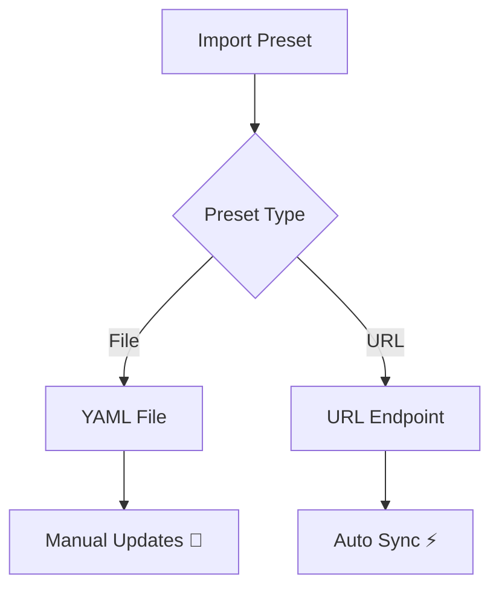

# Preset Management Guide

> [!IMPORTANT] 
> Currently, **Desktop App** does not directly provide server-side capabilities, so we do not provide a Preset for the open source community. welcome community developers to contribute your presets [here](../examples/presets/).

A **preset** is a collection of [settings](./setting.md) (_Introduced at [#61](https://github.com//Desktop App/pull/61)_), **Desktop App** supports import presets via `files` or `URLs`:



<br>


## Preset Types Comparison

| Feature | Local Presets | Remote Presets |
|-----------------------|------------------------|------------------------|
| **Storage** | Device-local | Cloud-hosted |
| **Update Mechanism** | Manual | Automatic |
| **Access Control** | Read/Write | Read-Only |
| **Versioning** | Manual | Git-integrated |


<br>


## Examples

### Import from file

**Desktop App** supports importing presets from files. Once the file is parsed successfully, the settings will be automatically updated.

| Function | Snapshot |
| --- | ---|


<br>


### Import from URL

**Desktop App** also supports importing presets from URLs. If automatic updates are set, presets will be automatically pulled every time the application is started.

| Function | Snapshot |
| --- | ---|


<br>


### Preset Example

```yaml
name: UI TARS Desktop Example Preset
language: en
vlmProvider: Hugging Face for TARS-1.5
vlmBaseUrl: https://your-endpoint.huggingface.cloud/v1
vlmApiKey: your_api_key
vlmModelName: your_model_name
reportStorageBaseUrl: https://your-report-storage-endpoint.com/upload
utioBaseUrl: https://your-utio-endpoint.com/collect
```

See all [example presets](../examples/presets).


